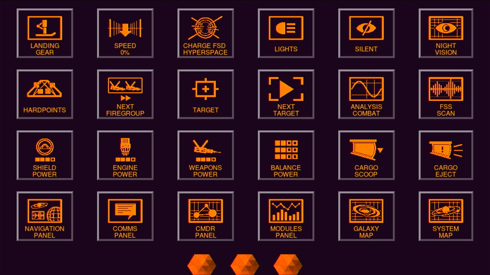

# PiKeyDeck
## Raspberry Pi 4 Side Deck for PC (Elite Dangerous)



## Introduction
This project turns Raspberry Pi 4 into touch HID device for PC. Why? I wanted to get back to Elite Dangerous and I wanted to move immersion to a higher level. Back in a days I have had some Android application that used WiFi to send keystrokes to a PC. This app required some daemon running on a computer and ... is it's no longer alive. There are similar solutions like [Gameglass](https://gameglass.gg/) or more sophisticated like [Elgato Stream Deck](https://www.elgato.com/us/en/p/stream-deck-mk2-black). If you are looking for easy to use, paid and maintained solutions for your game, you should check them out. I think, this project is for people who like engineering/hacking more than actual game itself. No matter what solution you choose, there is some cost anyway. In my case, I have had all the necessary parts already at home, so all I had to do was to get them together. One of the benefits of this solution is no need of installing anything on your PC. This PiKeyDeck is visible as a keyboard device. Click video link below to see how it works.

[](https://www.youtube.com/watch?v=zBI5xxNRmJM)

## Requirements
### Hardware
* [Raspberry Pi 4](https://www.raspberrypi.com/products/raspberry-pi-4-model-b/)
* [Waveshare 11303 7" LCD touch screen](https://www.waveshare.com/7inch-hdmi-lcd-c-with-bicolor-case.htm)
* [PoE+ HAT](https://www.raspberrypi.com/products/poe-plus-hat/)
* Usb C <-> Usb A cable
* Ethernet cord 
* PoE power adapter / switch 
* [Usb Pendrive](https://sandisk-store.pl/pl/p/Sandisk-ULTRA-32GB-USB-3.0-FLASH-DRIVE-Pendrive/23078340)

You may wonder why I needed PoE hat? That's because of Raspberry Pi 4 power requirements. Official recommendation for this SBC is 5.1V at 3.0A. Standard USB 3.0 ports are able to deliver 0.9A and 1.5A if dedicated to charging. Those values may not be fully accurate but it doesn't change the fact that my Pi was not even able to boot when was powered from PC. It's also worth mentioning that Waveshare Touchscreen requires ~0.5A. There are alternatives to PoE, like delivering power directly to GPIO pins or some kind of USB power injector cables. I do not recommend them.

### Software / Images
* Raspbian 64bit
* Python3
* [PySimpleGUI](https://www.pysimplegui.org/en/latest/)
* Pi HID device
* [Streamdeck Elite Icons](https://github.com/Ordo-Corona-Stellarum/streamdeck-elite-icons) 


I'll skip the part regarding installation of Raspbian, enabling SSH server and setting up Waveshare Touchscreen in /boot/config.txt. I assume you are either familiar with those topics or you are at least capable of reading documentation. One more thing, I used USB stick for OS as it's faster and more reliable than SD Card... isn't it? Assuming you have your Raspberry Pi 4 up and running and LCD Touchscreen is configured, you may ssh to it and start configuring your PiKeyDeck. First make it a HID device. There are a lot of tutorials on the Internet [[1]](https://github.com/raspberrypisig/pizero-usb-hid-keyboard) [[2]](https://howchoo.com/pi/raspberry-pi-gadget-mode/) [[3]](https://randomnerdtutorials.com/raspberry-pi-zero-usb-keyboard-hid/). I went through some of them and I think I used this [script](https://github.com/mtlynch/key-mime-pi/blob/master/enable-usb-hid) that installed an *usb-gadget* service and configured my USB-C port. The goal is to have `/dev/usbhidg0` available. It's used to send keycodes to a PC.

Since pip3 installation method is blocked in Raspbian by default, you need to setup proper Python environment.
```
$ python -m venv .venv
$ source .venv/bin/activate
(.venv) $
```
Next, install PySimpleGUI and some requirements :
```
(.venv) pip3 install PySimpleGUI pillow
```

Clone PiKeyDeck:
```
(.venv) $ git clone https://github.com/d3cker/PiKeyDeck.git
(.venv) $ cd PiKeyDeck
```

Clone icons repository inside PiKeyDeck folder:
```
(.venv) ~/PiKeyDeck $ git clone https://github.com/Ordo-Corona-Stellarum/streamdeck-elite-icons
```


## Configuration
Configuration file (`config.json`) has JSON format. There are two main sections: **General** with general options and **DeckButtons** with buttons definitions. 

* General configuration 

| Key                      | Default Value             | Description                                 |
|--------------------------|---------------------------|---------------------------------------------|
| `icons_path`             | "streamdeck-elite-icons"  | Absolute/relative path for icons repository |
| `icons_theme`            | "Sidewinder Orange"       | Relative path inside icons repository for different color schemes |
| `image_scale`            | "3"                       | Buttons image size. It's a subsample value so higher number means smaller image |
| `row_max_buttons`        | "6"                       | Max buttons per row                        |
| `deck_theme`             | "Dark Purple 4"           | PySimpleGUI theme. List available [here](https://www.pysimplegui.org/en/latest/cookbook/#themes-window-beautification)| 
| `deck_font_name`         | "Arial"                   | Font name for title text                  |
| `deck_font_size`         | "25"                      | Font size for title text                   |
| `deck_text`              | ""                        | Title text. Disabled by default            |
| `button_pad_x`           | "25"                      | Horizontal button padding                  |
| `button_pad_y`           | "12"                      | Vertical button padding                    |
| `button_resize`          | "False"                   | Allow buttons resize to fit the screen     |
| `empty_buttons`          | "True"                    | Generate "empty" buttons to fit row        |
| `border_width`           | "4"                       | Button border size                         |
| `button_font_color`      | "orange"                  | Override theme button font color value     |
| `button_color_overwrite` | "True"                    | Override theme button font color           |
| `key_release_delay`      | "0.3"                     | Key release delay (s)                      |

* DeckButtons definition list. Each key has the following features:

| Key            | Example Value             | Description                       |
|----------------|---------------------------|-----------------------------------|
| `key_name`     | "L"                       | Key name / event. Must be uniq.   |
| `key_code`     | "0x0f"                    | Hex value of HID key code         |
| `key_text`     | "\n\n\n\n\nLANDING\nGEAR" | Button description.               |
| `key_icon`     | "landing-gear-normal.png" | Button icon filename. Must be located in `icons_path`/`icons_theme`.|


Limitations:

* Key sequences are not supported (but doable).
* Button animations are not supported due to lack of subsample support in UpadteAnimation() call. 

Note: List of USB HID key codes is available [here](https://usb.org/sites/default/files/hut1_3_0.pdf) in section *10 Keyboard/Keypad Page (0x07)*


## Usage

Connect USB-C (charging port ) of your Raspberry Pi 4 to USB-A any port in PC. 

Login via ssh to your PiKeyDeck and type:
```
~/pikeydeck $ source ~/.venv/bin/activate
```
Set up local DISPLAY: 
```
(.venv) ~/pikeydeck $ export DISPLAY=:0
```

Start PiKeyDeck app:
```
(.venv) ~/pikeydeck $ python3 PiKeyDeck.py
```

And have a fun! In order to exit the PiKeyDeck press one of three buttons at the bottom. 


